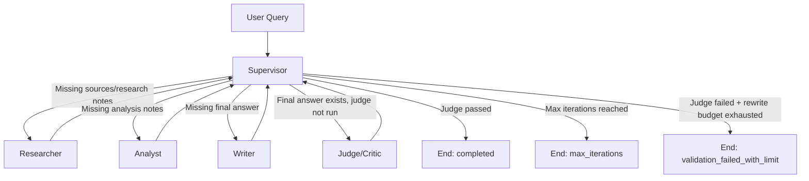

# Multi-Agent Research Lab — Submission Summary

**Sinh viên:** Nguyễn Huy Tú  
**MSV:** 2A202600170

---

## 1) Mục tiêu bài lab

Hoàn thiện starter skeleton thành hệ thống multi-agent chạy thực tế theo hướng production-oriented:
- chạy workflow bằng LangGraph,
- tích hợp LLM runtime thật,
- dùng search thật (Tavily),
- có Judge để chấm chất lượng,
- có tracing local + Langfuse để quan sát từng bước.

---

## 2) Kết quả đã hoàn thành

### 2.1 Multi-agent workflow chạy end-to-end
Pipeline thực tế đã xác minh:
- `researcher -> analyst -> writer -> judge -> end`

Có `stop_reason` rõ ràng và guardrails tránh loop vô hạn.

### 2.2 Tích hợp LLM runtime thật
- Analyst, Writer, Judge đã dùng `LLMClient` thay cho placeholder.
- Có timeout/retry theo config.
- Hỗ trợ OpenAI-compatible endpoint qua `OPENAI_BASE_URL`.

### 2.3 Chuẩn hóa output để ổn định
- Analysis output giữ format section nhất quán.
- Final answer luôn có `Citations` và `Limitations`.
- Structured output parser cho Judge được làm robust hơn (xử lý JSON có code-fence/bao quanh text).

### 2.4 Tracing và xác minh Langfuse
- Có local trace JSONL.
- Đã xử lý lỗi “không thấy trace trên Langfuse”.
- Đã verify bằng CLI `lf` và observation theo trace id.

---

## 3) Agent flow (Mermaid)



---

## 4) Các điểm tối ưu/cải thiện đã thực hiện

1. **Tối ưu kiến trúc runtime**
   - Tách vai trò rõ giữa Supervisor / Researcher / Analyst / Writer / Judge.
   - Giữ routing deterministic theo state để dễ debug.

2. **Tối ưu tích hợp LLM**
   - Chuyển từ placeholder sang LLM thật tại các node chính.
   - Bổ sung `OPENAI_BASE_URL` để chạy qua local OpenAI-compatible gateway.
   - Retry/timeout cấu hình hóa, không hardcode.

3. **Tối ưu độ bền output**
   - Cải thiện parse structured JSON cho judge output.
   - Chuẩn hóa các section bắt buộc để giảm flaky behavior do variation model.

4. **Tối ưu quan sát hệ thống (observability)**
   - Duy trì local trace fallback.
   - Đồng bộ cấu hình Langfuse theo settings app.
   - Kiểm tra traces/observations bằng CLI để xác nhận node-level visibility.

5. **Tối ưu độ ổn định triển khai**
   - Re-run test sau các thay đổi quan trọng.
   - Đảm bảo behavior mới không phá regression của bộ test hiện có.

---

## 5) Minh chứng nộp bài

### 5.1 Tài liệu đã hoàn thiện
- Design template (điền đầy đủ):  
  [`docs/design_template.md`](docs/design_template.md)
- Lab guide tổng hợp triển khai:  
  [`docs/lab_guide.md`](docs/lab_guide.md)
- Peer review rubric (đã chấm thực tế tối đa):  
  [`docs/peer_review_rubric.md`](docs/peer_review_rubric.md)
- Production implementation plan tham chiếu:  
  [`docs/production_implementation_plan.md`](docs/production_implementation_plan.md)

### 5.2 Ảnh trace Langfuse
- [`docs/langfuse_trace.png`](docs/langfuse_trace.png)

---

## 6) Lệnh kiểm tra nhanh

```bash
# Run workflow thực tế
python -m multi_agent_research_lab.cli multi-agent --query "..." --json

# Run test suite
pytest -q

# Kiểm tra Langfuse
.venv/Scripts/lf.exe --host https://cloud.langfuse.com traces list --limit 10
.venv/Scripts/lf.exe --host https://cloud.langfuse.com observations list --trace-id <TRACE_ID> --limit 50
```

---

## 7) Kết luận

Bài lab đã đạt mục tiêu nộp bài ở mức production-oriented:
- workflow multi-agent chạy thực tế,
- LLM + judge hoạt động,
- tracing quan sát được từng node,
- tài liệu và rubric đã hoàn thiện đầy đủ để phục vụ review/chấm điểm.